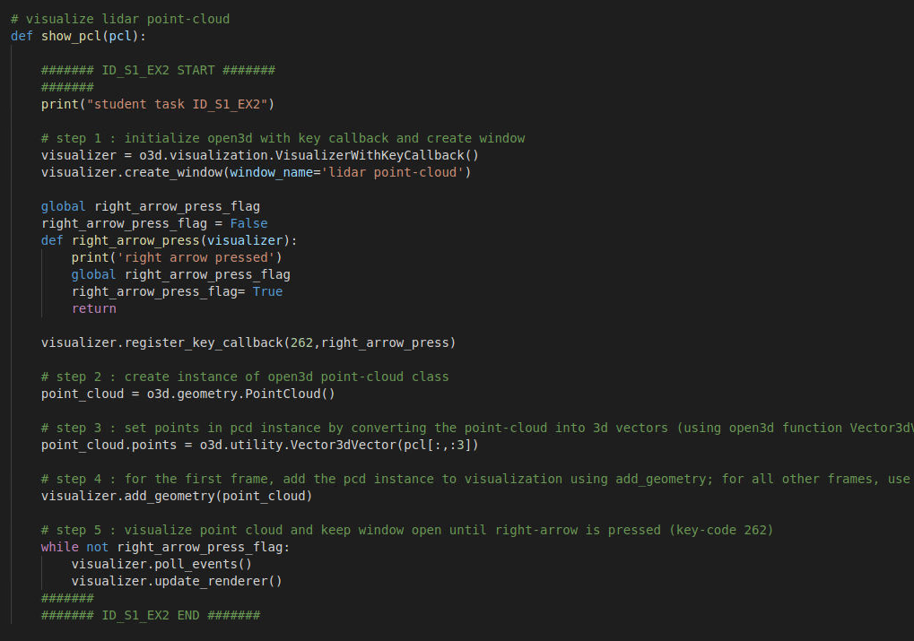
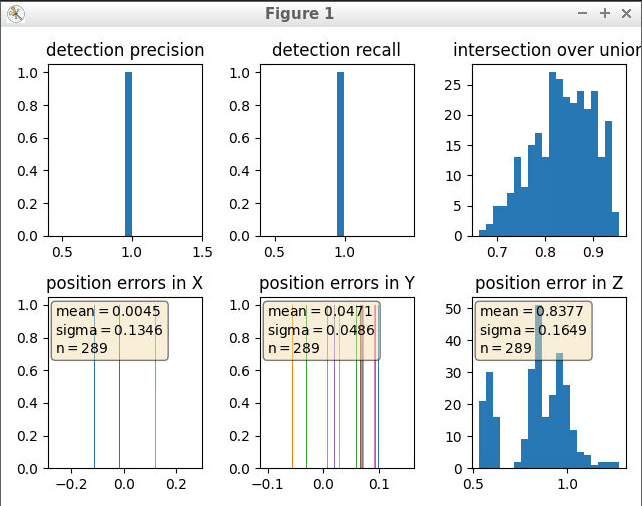
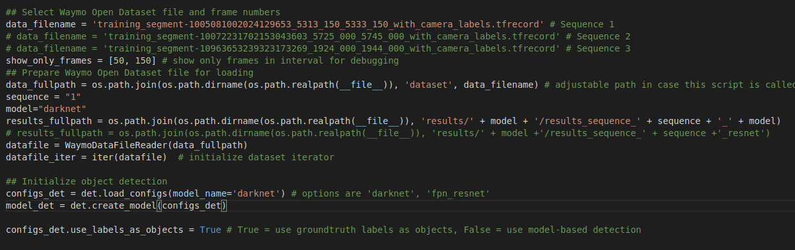
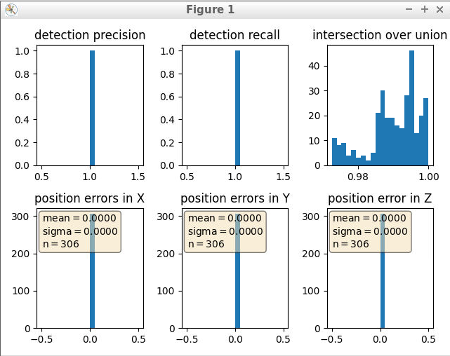

# Project: Midterm: 3D Object Detection


## Dataset
[Waymo Open Dataset's](https://console.cloud.google.com/storage/browser/waymo_open_dataset_v_1_2_0_individual_files) 
This is real-world data and leveraged 3D point cloud data for lidar-based object detection.

## Project Tasks

### Section 1: Computing Lidar Point Clouds from Range Images
Tasks:
- Adjusted the ranges channel to 8-bit and visualized the range/intensity image (ID_S1_EX1).
- Utilized the Open3D library to showcase the lidar point cloud in a 3D viewer, identifying 10 images derived from the point cloud (ID_S1_EX2).

### Section 2: Creating Birds-Eye Views from Lidar PCL
Tasks:
- Generated a Birds Eye View perspective (BEV) of the point cloud, mapping lidar intensity values onto the BEV, and standardizing the height map for each BEV (ID_S2_EX1, ID_S2_EX2, ID_S2_EX3).

### Section 3: Implementing Model-based Object Detection in BEV Image
Tasks:
- Incorporated additional parameters from the repository in conjunction with YOLO, instantiated the fpn resnet model (ID_S3_EX1).
- Transformed BEV coordinates into pixel coordinates and reformatted the model output into bounding box format (ID_S3_EX2).

### Section 4: Evaluating Performance for Object Detection
Tasks:
- Calculated the intersection over union (IOU), labeling detected objects when the IOU exceeds a specific threshold (ID_S4_EX1).
- Determined false positives and false negatives, computing precision and recall metrics (ID_S4_EX2, ID_S4_EX3).


## Project running

The project can be run by running

```
python loop_over_dataset.py
```


## Section 1: Compute Lidar point cloud from Range Image

### Visualize range image channels (ID_S1_EX1)

- Convert range image “range” channel to 8bit
- Convert range image “intensity” channel to 8bit
- Crop range image to +/- 90 deg. left and right of the forward-facing x-axis
- Stack cropped range and intensity image vertically and visualize the result using OpenCV

Coding in `objdet_pcl.py` file:


Coding in `loop_over_dataset.py` file:


Result for Visualize range image channels (ID_S1_EX1):


### Visualize point-cloud (ID_S1_EX2)

Coding in `objdet_pcl.py` file:



Coding in `loop_over_dataset.py` file:


Result for Visualize point-cloud (ID_S1_EX2):


Some vehicle features that appear stable in most of the inspected examples:
- **Wheelbase**: Despite visibility differences, the relative distance between the front and rear wheels often remains stable, aiding in identifying a vehicle's size and type.
- **Roofline**: The roofline, especially in profile views, tends to maintain a consistent shape across varying visibility, offering clues about the vehicle's structure and design.
- **Hood and Trunk**: The general outline of the hood and trunk might exhibit stability even when partially obscured, providing insights into the vehicle's length and shape.
- **Distinctive Vehicle Shapes**: Unique shapes or silhouettes of certain vehicle types, such as trucks (such as _example 8_)
- **Side Mirrors**: The position and size of side mirrors often remain relatively consistent


## Section 2:Creating Birds-Eye Views from Lidar PCL

- Convert sensor coordinates to bev-map coordinates (ID_S2_EX1)
- Compute intensity layer of bev-map (ID_S2_EX2)
- Compute height layer of bev-map (ID_S2_EX3)

Coding in `objdet_pcl.py` file:


Coding in `loop_over_dataset.py` file:


Result for Convert sensor coordinates to bev-map coordinates:


Result for Compute intensity layer of bev-map:


Result for Compute height layer of bev-map:


### Section 3: Implementing Model-based Object Detection in BEV Image

- Add a second model from a GitHub repo (ID_S3_EX1)
  - In addition to Complex YOLO, extract the code for output decoding and post-processing from the [GitHub repo](https://github.com/maudzung/SFA3D)
- Extract 3D bounding boxes from model response (ID_S3_EX2)
  - Transform BEV coordinates in [pixels] into vehicle coordinates in [m]
  - Convert model output to expected bounding box format [class-id, x, y, z, h, w, l, yaw]

Coding in `loop_over_dataset.py` file:


Some results for this section:


## Section 4: Evaluating Performance for Object Detection

- Compute intersection-over-union (IOU) between labels and detections (ID_S4_EX1)
- Compute false-negatives and false-positives (ID_S4_EX2)
- Compute precision and recall (ID_S4_EX3)

Coding in `loop_over_dataset.py` file:


Result for this section with `configs_det.use_labels_as_objects = False`:

```
precision = 0.95065789, recall = 0.94444444
```



Change code to `configs_det.use_labels_as_objects = True` in `loop_over_dataset.py` file:



Result for this section with `configs_det.use_labels_as_objects = True`:

```
precision = 1.0, recall = 1.0
```




## Summary of Lidar based 3D Object Detection
- This project showcases a comprehensive understanding of processing lidar data, transforming it into BEV maps, and implementing sophisticated object detection techniques. Challenges might have emerged in transforming coordinates or integrating models accurately.
- This project demonstrates a solid grasp of lidar-based object detection, offering insights into challenges and opportunities for improvement in real-world sensor fusion scenarios.
- Merging camera and LiDAR technologies holds promise in augmenting detection accuracy by integrating the depth perception of LiDAR with the detailed texture information captured by cameras. This fusion has the potential to significantly elevate the precision of object detection and tracking, refining these processes to a higher degree of accuracy.
- Challenges in Real-Life Scenarios:
  - Sensor Variability: Differences in sensor quality, calibration, and data synchronization could complicate fusion.
  - Environmental Factors: Varied lighting conditions, occlusions, and dynamic scenes might affect fusion accuracy.
  - Project Challenges: Challenges might have mirrored real-life scenarios, especially with model integration and coordinate transformations.
- Improvement Strategies:
  - Refine Integration: Fine-tune coordinate transformations and model integration for better alignment.
  - Sensor Calibration: Improve fusion accuracy by addressing sensor calibration disparities.
  - Adaptive Algorithms: Develop algorithms resilient to varying environmental conditions for robust tracking.
  - Uses newer (state of the art) AI algorithms for better object detection, accuracy, and faster processing speed
