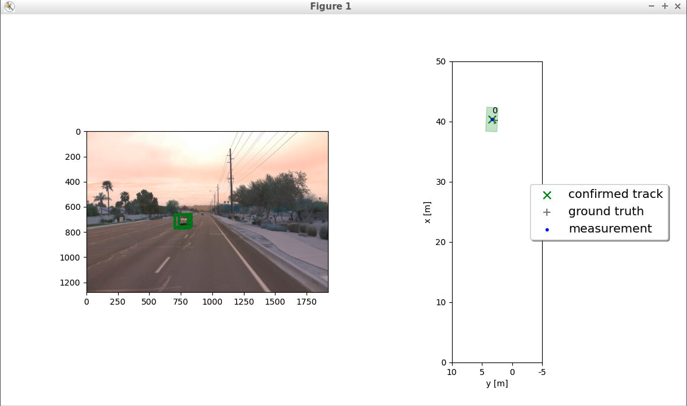
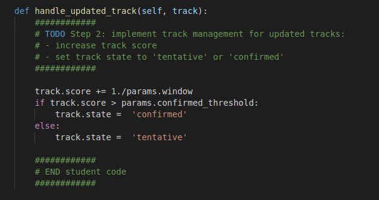
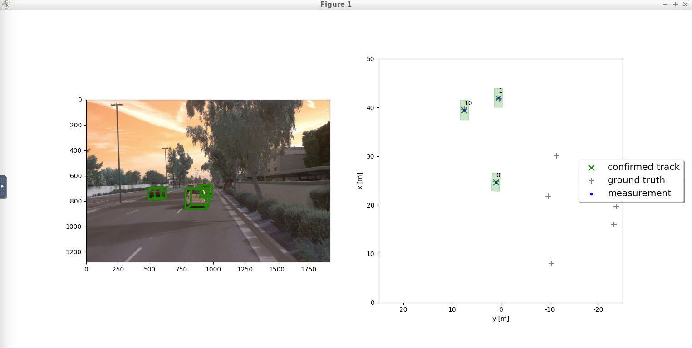

# Final Project: Sensor Fusion and Object Tracking


## Dataset
[Waymo Open Dataset's](https://console.cloud.google.com/storage/browser/waymo_open_dataset_v_1_2_0_individual_files) 
This is real-world data and leveraged 3D point cloud data for lidar-based object detection.

## Project Tasks

### Section 1: Tracking
The primary objective is to implement an Extended Kalman Filter (EKF) for tracking a single real-world target using lidar measurements. This involves constructing prediction and update functions within the EKF framework, calculating system matrices for a 3D constant velocity model, and integrating these functions to estimate and refine the target's state over time

### Section 2: Track Management

The primary objective is to implement track management functionalities within the project framework. This involves initializing and deleting tracks based on lidar measurements, transforming measurements to vehicle coordinates, and managing track states and scores. The tasks include refining track initialization, adjusting track scores based on unassigned tracks, deleting tracks with low scores or large covariance, and appropriately handling updated tracks to determine their state (tentative or confirmed)

### Section 3: Data Association
The primary objective is to implement a single nearest neighbor data association method for associating measurements to tracks, marking a transition into multi-target tracking. The tasks involve generating the association matrix using Mahalanobis distances between tracks and measurements, gating measurements within a track's gate, updating lists of unassigned measurements and tracks, and finding the closest association pair

### Section 4: Sensor Fusion

The primary objective is to finalize the sensor fusion module by implementing the nonlinear camera measurement model for camera-lidar fusion. This involves integrating camera measurements into the tracking process by checking object visibility within the camera's field of view, transforming position estimates into camera coordinates, projecting to image coordinates, and generating camera measurements. Tasks include implementing functions within the Sensor class for field-of-view visibility checks and nonlinear camera measurement models, as well as initializing camera measurement objects in the Measurement class


## Project running

The project can be run by running

```
python loop_over_dataset.py
```
## Project result

The results of the project are saved in the final_project folder of this repository. Includes code screenshots of each section and corresponding mean RMSE results. tracking results video is located in the evalution folder inside the final_project folder.

📦project<br>
┃<br>
┣ 📂final_project<br>
┃ ┣ 📂s1--> Includes code screenshots of each section and corresponding mean RMSE results of section 1<br>
┃ ┣ 📂s2 --> Includes code screenshots of each section and corresponding mean RMSE results of section 2<br>
┃ ┣ 📂s3 --> Includes code screenshots of each section and corresponding mean RMSE results of section 3<br>
┃ ┣ 📂s4 --> Includes code screenshots of each section and corresponding mean RMSE results of section 4<br>
┃ ┗ 📂evaluation --> Includes tracking results video and the best result of mean RMSE<br>


## Section 1: Tracking

### Track objects over time with a Kalman Filter

- EKF is implemented including appropriate system matrix F and process noise Q for constant velocity motion model.
- EKF is applied to a simple single-target scenario with lidar only.
- The mean RMSE is 0.35 or smaller. Please upload the RMSE plot as png or pdf file.

Coding in `filter.py` file:


Coding in `loop_over_dataset.py` file:


Result for Track objects over time with a Kalman Filter:

- Single target tracking:


- The mean RMSE is **0.27**


## Section 2: Track Management

### Initialize, update and delete tracks

- Track initialization from unassigned measurements is implemented.
- A track score is defined and implemented.
- Track states are defined and implemented, e.g. “tentative”, “confirmed”.
- Old tracks are deleted for not updated tracks

Coding in `trackmanagement.py` file:




Coding in `loop_over_dataset.py` file:


Result for Initialize, update and delete tracks:

- The mean RMSE is **0.78**


## Section 3: Data Association

### Associate measurements to tracks with nearest neighbor association

- Nearest neighbor data association including association matrix is implemented.
- A method that returns nearest track and measurement for association is implemented.
- Gating method with chi-square-distribution is implemented to reduce complexity.

Coding in `association.py` file:


Coding in `loop_over_dataset.py` file:


Result for Associate measurements to tracks with nearest neighbor association:

- The mean RMSE for multi targets tracking are **0.12**, **0.15**, **0.19**


### Section 4: Sensor Fusion

### Section 4: SWBAT fuse measurements from lidar and camera

- Camera measurements including appropriate covariance matrix R are implemented.
- Nonlinear camera measurement model h(x) is implemented. The Jacobian H is given.
- A method that checks whether an object can be seen by the camera or is outside the field of view is implemented.
- The tracking works properly if you see the following results: The tracking loop now updates all tracks with lidar measurements, then with camera measurements. The console output shows lidar updates followed by camera updates.
- The visualization shows that the tracking performs well, again no confirmed ghost tracks or track losses should occur.

Coding in `measurements.py` file:


Coding in `loop_over_dataset.py` file:


Result for SWBAT fuse measurements from lidar and camera:

- Example for multi targets tracking



- The mean RMSE for multi targets tracking are **0.10**, **0.14**, **0.17**


- The output video `final_project/evaluation/my_tracking_results.avi`


## Evaluation and Conclusion

### Evaluation
- The tracking evaluation using RMSE indicates a commendable performance. The RMSE plot displays three tracks that have been confirmed throughout the sequence. Specifically, two of these tracks demonstrate exceptional continuity, maintaining their trajectory seamlessly from the beginning (0s) to the end (200s) without any instances of track loss.

- The mean RMSE values further substantiate the accuracy of these long-tracked targets, with respective values of 0.10, 0.14, and 0.17. These metrics signify a high level of precision and consistency in tracking multiple targets across the entire duration of the sequence.

- Overall, the achieved mean RMSE values below 0.25 for these extensively tracked targets underscore the robustness and reliability of the multi-target tracking system, showcasing its proficiency in maintaining accurate estimations across diverse scenarios within the dataset.


### Conclusion
1. Recap of Tracking Steps and Implemented Solutions:
   - Tracking (Step 1): Implemented an Extended Kalman Filter (EKF) for single target tracking using lidar measurements. Achieved an RMSE mean of **0.27** (lower than 0.35).
   - Track Management (Step 2): Incorporated track initialization, state management, and deletion based on track score and covariance. Ensured accurate track initiation and deletion upon object disappearance.
   - Association (Step 3): Implemented nearest neighbor data association for multiple targets, associating measurements to tracks effectively without creating ghost tracks.
   - Camera Fusion (Step 4): Integrated nonlinear camera measurement models into the sensor fusion module, enabling the utilization of camera measurements alongside lidar data for tracking. Achieved a mean RMSE below 0.25 (specifically **0.10**, **0.14**, **0.17** on 3 tracks) for multiple confirmed tracks. 

*The most challenging part was likely the association step due to its complexity in correctly matching measurements to tracks without generating erroneous associations.*

2. Benefits of Camera-Lidar Fusion:
   - Camera-lidar fusion offers enhanced object localization and recognition by leveraging the complementary strengths of both sensors. Lidar provides precise distance measurements, while cameras offer rich visual information like object appearance and texture.
   - In practice, camera-lidar fusion showcased improved tracking accuracy, evident in the achieved mean RMSE values below 0.25 (specifically **0.10**, **0.14**, **0.17** on 3 tracks). It's much better to just use the lidar sensor's EKF filter(The mean RMSE is **0.27**). The combination of lidar's precise spatial data with the visual details from cameras improved the tracking robustness. 

3. Challenges in Real-Life Scenarios:
   - Sensor Variability: Differences in sensor quality, calibration, and data synchronization could complicate fusion.
   - Environmental Factors: Varied lighting conditions, occlusions, and dynamic scenes might affect fusion accuracy.
   - Project Challenges: Challenges might have mirrored real-life scenarios, especially with model integration and coordinate transformations.

4. Improvement Strategies:
   - Refine Integration: Fine-tune coordinate transformations and model integration for better alignment.
   - Sensor Calibration: Improve fusion accuracy by addressing sensor calibration disparities.
   - Adaptive Algorithms: Develop algorithms resilient to varying environmental conditions for robust tracking.
   - Uses newer (state of the art) AI algorithms for better object detection, accuracy, and faster processing speed
